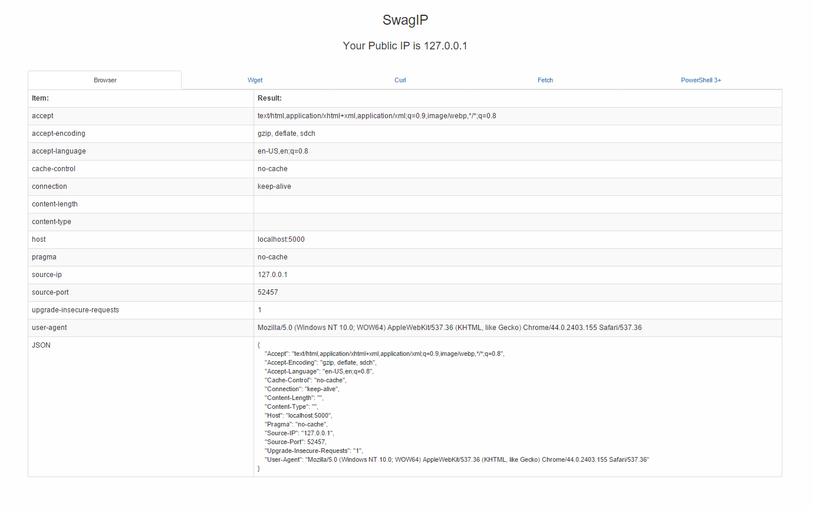
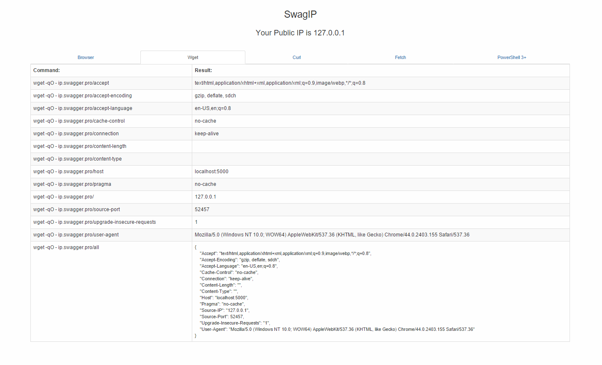
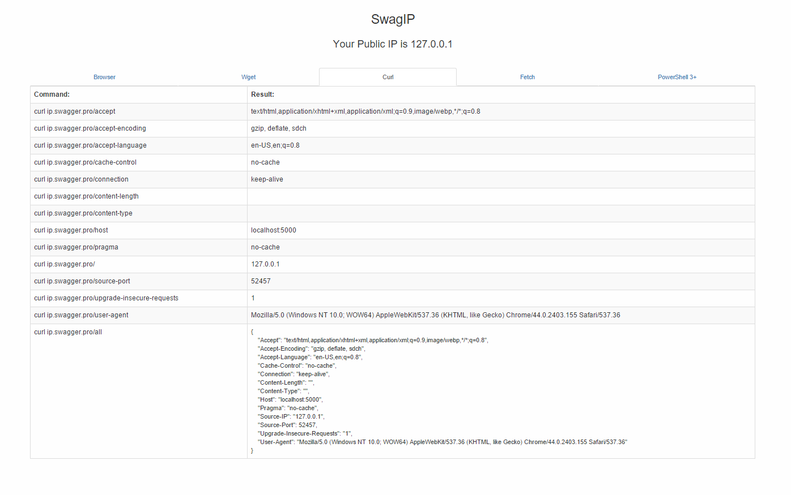
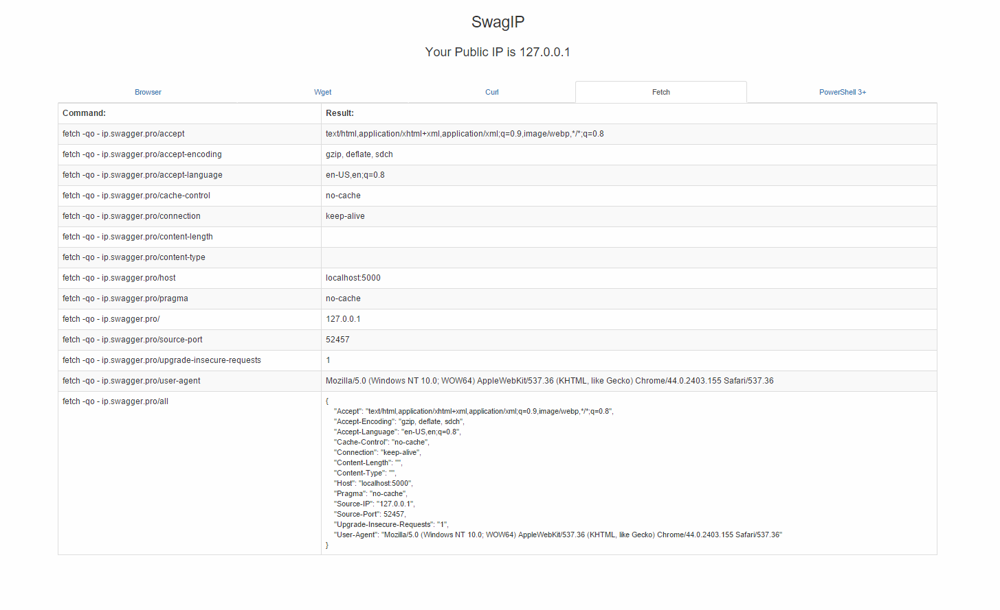
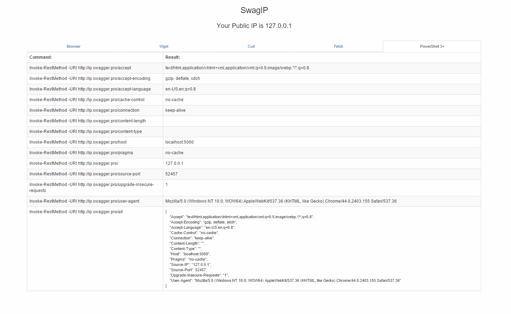

## SwagIP

A simple way to get your IP address (and other information).  
 curl ip.swagger.pro

### Installing
```
$ pip install -r requirements.txt
$ python app.py
```
### Tests
```
$ py.test tests/
```

### Docker!
We use docker to scale this application.
```
$ docker build .
```

### Screenshots
#####Browser Information:


#####Wget Commands:


#####Curl Commands:


#####Fetch Commands:


#####PowerShell Commands:

